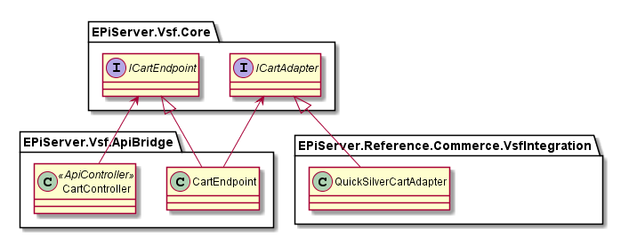
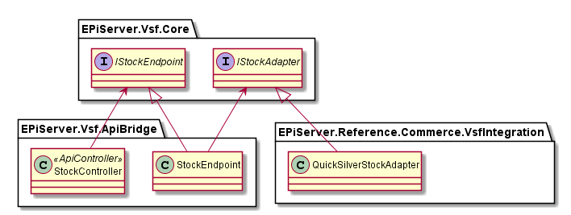
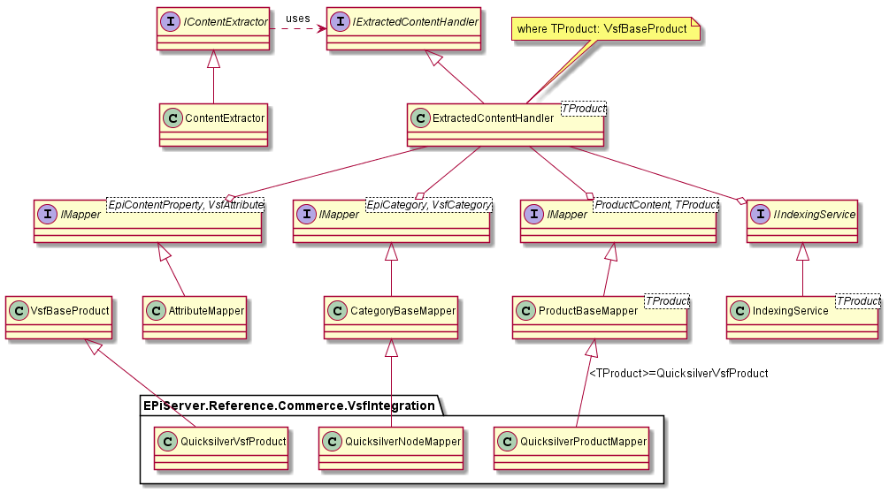

# EPiServer Commerce - VueStorefront integration demo

This is a demo implementation showing how to use EpiServer Commerce as a backend platform for [Vue Storefront](https://github.com/DivanteLtd/vue-storefront). 
This demo is based on the [Episerver Commerce Quicksilver sample site](https://github.com/episerver/Quicksilver). The main goal of this project is to provide a set of algorithms and data structures that will help with the integration of EPiServer Commerce and Vue StoreFront. Provided solution consists of two parts: ApiBridge and DataExporter.
1. ApiBridge - implements web api required by VSF
2. DataExporter - reading, converting and exporting data models from EpiServer to Elasticsearch (where it can be accessed by VSF)

Although the example implementation in based on Quicksilver, both ApiBridge and DataExporter have been developed with customization in mind. 

## Project setup
1. Setup Quicksilver demo - [Quicksilver project](https://github.com/makingwaves/epi-commerce-to-vue-storefront/tree/master/Quicksilver)
2. Setup VSF application - [Windows Installation](https://docs.vuestorefront.io/guide/installation/windows.html) or [Linux Installation](https://docs.vuestorefront.io/guide/installation/linux-mac.html)

### Changes introduced to Quicksilver demo
1. <b>EPiServer.Reference.Commerce.VsfIntegration</b> project has been added. This project contains examples of custom model mappers (e.g. QuicksilverProductMapper) and service adapters (e.g. QuickSilverUserAdapter). 
2. <b>EPiServer.Reference.Commerce.Site->Features->Product->Models</b> has been moved to <b>EPiServer.Reference.Commerce.Shared->Models->Products</b>

## How to run this demo
### 1. Configuration 
#### 1. vue-storefront local.config
An working example can be found [HERE](https://github.com/makingwaves/epi-commerce-to-vue-storefront/blob/master/doc/vue-storefront-local.json) <br>
List of customized properties with example values:
```
{
    "elasticsearch": {
      "index": "epi-catalog",
      ...
    },
    "cart": {
      "setCustomProductOptions": false,
      "setConfigurableProductOptions": false,
      "create_endpoint": "http://localhost:50244/vsbridge/Cart/create?token={{token}}",
      "updateitem_endpoint": "http://localhost:50244/vsbridge/Cart/update?token={{token}}&cartId={{cartId}}",
      "deleteitem_endpoint": "http://localhost:50244/vsbridge/Cart/delete?token={{token}}&cartId={{cartId}}",
      "pull_endpoint": "http://localhost:50244/vsbridge/Cart/pull?token={{token}}&cartId={{cartId}}",
      "totals_endpoint": "http://localhost:50244/vsbridge/Cart/totals?token={{token}}&cartId={{cartId}}",
      "paymentmethods_endpoint": "http://localhost:50244/vsbridge/Cart/payment-methods?token={{token}}&cartId={{cartId}}",
      "shippingmethods_endpoint": "http://localhost:50244/vsbridge/Cart/shipping-methods?token={{token}}&cartId={{cartId}}",
      "shippinginfo_endpoint": "http://localhost:50244/vsbridge/Cart/shipping-information?token={{token}}&cartId={{cartId}}",
      "collecttotals_endpoint": "http://localhost:50244/vsbridge/Cart/collect-totals?token={{token}}&cartId={{cartId}}",
      "deletecoupon_endpoint": "http://localhost:50244/vsbridge/Cart/delete-coupon?token={{token}}&cartId={{cartId}}",
      "applycoupon_endpoint": "http://localhost:50244/vsbridge/Cart/apply-coupon?token={{token}}&cartId={{cartId}}&coupon={{coupon}}",
      ...
    },
    "users": {
      "endpoint": "http://localhost:50244/vsbridge/user",
      "history_endpoint": "http://localhost:50244/vsbridge/user/order-history?token={{token}}",
      "resetPassword_endpoint": "http://localhost:50244/vsbridge/user/reset-password",
      "changePassword_endpoint": "http://localhost:50244/vsbridge/user/change-password?token={{token}}",
      "login_endpoint": "http://localhost:50244/vsbridge/user/login",
      "create_endpoint": "http://localhost:50244/vsbridge/user/create",
      "me_endpoint": "http://localhost:50244/vsbridge/user/me?token={{token}}",
      "refresh_endpoint": "http://localhost:50244/vsbridge/user/refresh",
      ...
    },
    "stock": {
      "endpoint": "http://localhost:50244/vsbridge/stock",
      ...
    },
    "images": {
      "useExactUrlsNoProxy": true,
      "baseUrl": "http://localhost:50244/vsbridge/image/",
      ...
    },
    ...
}
```

#### 2. vue-storefront-api local.config
An working example file can be found [HERE](https://github.com/makingwaves/epi-commerce-to-vue-storefront/blob/master/doc/vue-storefront-api-local.json) <br>
List of customized properties with example values:
```
{
  "elasticsearch": {
    "indices": [ "epi-catalog" ],
    ...
  },
  ...
}
```

#### 3. EPiServer.Reference.Commerce.Site - web.config
List of customized properties with example values:
```
<configuration>
    <configSections>
        ...
        <section name="vsf.export" type="EPiServer.Vsf.DataExport.Configuration.VsfExporterConfiguration, EPiServer.Vsf.DataExport"/>
        <section name="vsf.apiBridge" type="EPiServer.Vsf.ApiBridge.VsfApiBridgeConfiguration, EPiServer.Vsf.ApiBridge"/>
    </configSections>
    ...
    <vsf.export 
        elasticServerUrls="http://127.0.0.1:9200" 
        indexAliasName="epi-catalog" 
        bulkIndexBatchSize="100" />

    <vsf.apiBridge 
        auth.signingKey="alamakotaalamakotaalamakotaalamakota"
        auth.issuer="quicksilver_issuer"
        auth.audience="quicksilver_audience"
        auth.accessTokenExpiration="60" />
```

### 2. Data Export
Quicksilver to VSF export procedure.<br>
1. Before exporting make sure that:<br>
1.1 VSF (vsf and vsf-api) is up and running<br>
1.2 Quicksilver page is up and running
2. Navigate to EPiServer CMS Admin panel ->  Scheduled Jobs -> Export to Vue Storefront
3. Start Manually

After the job has finished, refresh VSF application - all product should be visible.

## Solution structure
Quicksilver example default projects:<br>
<b>EPiServer.Reference.Commerce.Site</b><br>
<b>EPiServer.Reference.Commerce.Shared</b><br>
<b>EPiServer.Reference.Commerce.Manager</b><br>

Actual Demo projects:<br>
<b>EPiServer.Vsf.Core</b> - set of core models and interfaces<br>
<b>EPiServer.Vsf.ApiBridge</b> - implementation of VSF web api bridge<br>
<b>EPiServer.Vsf.DataExport</b> - implementation of exporting and model mapping algorithms <br>
<b>EPiServer.Reference.Commerce.VsfIntegration</b> - quick silver customization. This project contains examples of custom model mappers (e.g. FashionProductMapper) and service adapters (e.g. QuickSilverUserAdapter).<br>


## Todo/Known bugs

1. <b>RefreshTokenRepository</b> - Currently there is only one class that implements <b>IRefreshTokenRepository</b> interface, and it is <b>MemoryRefreshTokenRepository</b>. 
2. <b>StockAdapter</b> - <b>QuickSilverStockAdapter</b> is not fully implemented. The returned <b>VsfStockCheck</b> object is in grate part mocked.
3. Placing order after checkout process with account creation does not properly assing order (due to userId) not being sent.

# EPiServer.Vsf.Core

This project provides a set of base classes and interfaces used in project EPiServer.Vsf.ApiBridge and EPiServer.Vsf.DataExport. The intent is that One can override whole logic with custom implementation.

## Folders structure
    .
    +-- ApiBridge - interfaces and models related to VueStoreFront Api bridge.
    |   +-- Adapter - adapter interfaces for managing users, cars and stock
    |   +-- Endpoint - api bridge interfaces
    |   +-- Model - models related to VueStoreFront Api bridge
    |   |   +-- Authorization - related to authorization 
    |   |   +-- Cart - related to carts 
    |   |   +-- Stock - related to stock
    |   |   +-- User - related to users
    +-- Exporting - set of interfaces related to exporting 
    +-- Mapping - set of interfaces related to exporting 

# EPiServer.Vsf.ApiBridge
This project provides the implementation for VSF api bridge. 
VSF api description can be found [HERE](https://github.com/DivanteLtd/vue-storefront-integration-boilerplate/blob/master/1.%20Expose%20the%20API%20endpoints%20required%20by%20VS/Required%20API%20specification.md#dynamic-requests-for-vue-storefront-api)
## Folders structure
    .
    +-- Authorization
    |   +-- Claims
    |   +-- Token
    +-- Controllers
    +-- Endpoints
    +-- Utils

## Authentication
<b>JwtBearerAuthentication</b> middleware is used with custom token provider (VsfJwtBearerTokenProvider). <br>
<b>VsfJwtBearerTokenProvider</b> class is able to extract Jwt token not only from Authorization header, but also from query string. <br>
<b>JwtUserTokenProvider</b> class is responsible for generating access and refresh tokens. 

More information about VSF authentication can be found 
[HERE](https://github.com/DivanteLtd/vue-storefront-integration-boilerplate/blob/master/1.%20Expose%20the%20API%20endpoints%20required%20by%20VS/Required%20API%20specification.md#post-vsbridgeuserlogin)

## Api status
<b>POST /vsbridge/cart/create</b> - implemented<br>
<b>GET /vsbridge/cart/pull</b> - implemented<br>
<b>POST /vsbridge/cart/update</b> - implemented<br>
<b>POST /vsbridge/cart/delete</b> - implemented<br>
<b>POST /vsbridge/cart/apply-coupon</b> - implemented (further testing needed)<br>
<b>POST /vsbridge/cart/delete-coupon</b> - implemented (further testing needed)<br>
<b>GET /vsbridge/cart/coupon</b> - implemented (further testing needed)<br>
<b>GET /vsbridge/cart/totals</b> - implemented (further testing needed)<br>
<b>GET /vsbridge/cart/payment-methods</b> - implemented (further testing needed)<br>
<b>POST /vsbridge/cart/shipping-methods</b> - implemented (further testing needed)<br>
<b>POST /vsbridge/cart/shipping-information</b> - implemented (further testing needed)<br>
<b>POST /vsbridge/cart/collect-totals</b> - implemented (further testing needed)<br>

<b>POST /vsbridge/user/create</b> - implemented<br>
<b>POST /vsbridge/user/login</b> - implemented<br>
<b>POST /vsbridge/user/refresh</b> - implemented<br>
<b>POST /vsbridge/user/resetPassword</b> - implemented<br>
<b>POST /vsbridge/user/changePassword</b> - implemented<br>
<b>GET /vsbridge/user/order-history</b> - implemented (further testing needed)<br>
<b>GET /vsbridge/user/me</b> - implemented<br>
<b>POST /vsbridge/user/me</b> - implemented<br>

<b>GET /vsbridge/stock/check/:sku</b> - partially implemented<br>

<b>POST /vsbridge/order/create</b> - implemented (further testing needed)<br>

## Overall class design





# EPiServer.Vsf.DataExport

This project provides support for exporting EPiServer Commerce models (mainly products, categories and variants) to Elasticsearch index, where it can consumed by VSF frontend app.

## Note 
VSF is using model structure similar to Magento2, and it is assumed that the reader is familiar with both models structures: EPiServer Commerce, Magent2 and he understands the differences between them.

## Folders structure
    .
    +-- Attributes
    +-- Configuration
    +-- Exporting
    +-- Mapping - set for models mappers (from EPiServer models to VSF)
    +-- Model - set of models suited for indexing in elasticsearch 
    +-- Utils
        +-- Epi

## Overall class layout


## Important classes description
<b>ContentExtractor</b> - is responsible for extracting data (nodes and products) from EpiServer Commerce. <b>ExtractedContentHandler</b> implements logic for handling that data (e.g. mapping to VSF model, indexing in Elasticsearch)<br>
<b>IndexingService</b> - implements logic for indexing data in Elasticsearch<br>
<b>AttributeMapper</b>, <b>CategoryBaseMapper</b>, <b>ProjectBaseMapper</b> - logic for mapping EPiServer Commerce models to VSF<br>
<b>VsfBaseProduct</b> - base VSF product model that should be customized. (see <b>QuicksilverVsfProduct</b>) <br>
<b>QuicksilverVsfProduct</b> - includes Quicksilver products specific properties (e.g. ColorOptions and SizeOptions)<br>
<b>QuicksilverProductMapper</b> - customized mapping for Quicksilver products<br>
<b>QuicksilverNodeMapper</b> - customized mapping for quicksilver nodes<br>

### Other important classes
<b>CategoryTreeBuilder</b> - is a helper class for mapping EPiServer NodeContent structure to VSF Category model<br>
<b>ContentPropertyReader</b> - helper class for reading EPiServer Variants properties marked with <b>VsfOptionAttribute</b><br>
<b>VsfOptionAttribute</b> - is used to mark Variants properties that should be automatically mapped to VSF attributes model. (see <b>EPiServer.Reference.Commerce.Shared.Models.Products.FashionVariant</b>)<br>

# EPiServer.Reference.Commerce.VsfIntegration
This project contains Quicksilver specific implementation (e.g. QuicksilverProductMapper, QuickSilverUserAdapter).

## Important classes
<b>InitializationModule</b> - InitializationModule that will setup DI for this demo<br>
<b>VueStorefrontExportJob</b> - EPiServer job that executes model exporting

# EPiServer.Reference.Commerce.Site
## VSF ApiBridge registration
In SiteInitialization.ConfigureContainer:
```
GlobalConfiguration.Configure(config =>
{
  config.IncludeErrorDetailPolicy = IncludeErrorDetailPolicy.LocalOnly;
  config.Formatters.JsonFormatter.SerializerSettings = new JsonSerializerSettings();
  config.Formatters.XmlFormatter.UseXmlSerializer = true;
  config.DependencyResolver = new StructureMapResolver(context.StructureMap());
  config.MapHttpAttributeRoutes();

  //REGISTER VSF API
  config.RegisterVueStorefrontBridge();
});
```

## VSF JwtBearerAuthentication registration
In Infrastructure.Owin.Startup.Configuration
```
//REGISTER VSF AUTH
app.RegisterVueStorefrontAuth(ConfigurationManager.GetSection("vsf.apiBridge") as VsfApiBridgeConfiguration);
```
